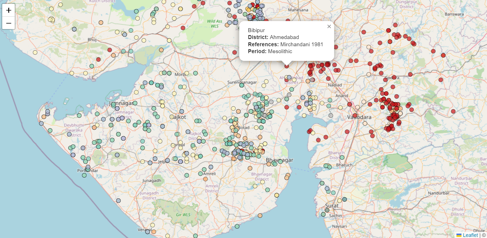

Website for [DARE | Digital Archaeology Research Environment](https://dare-lab.github.io), a CFI research space and group at the University of British Columbia, Okanagan, located on the unceded, ancestral lands of the syilx/Okanagan people.